# Editorial agent — target architecture (vs today)

Honest map of what you are building, how the system works now, where it lies, and where it must go. Use this with [`EDITORIAL_AGENT_STEPS.md`](./EDITORIAL_AGENT_STEPS.md) for step-by-step detail.

---

## 1. Product in one picture

You are not building “an AI that fills a database.” You are building a **published timeline** where every day is a trustworthy card on the homepage.

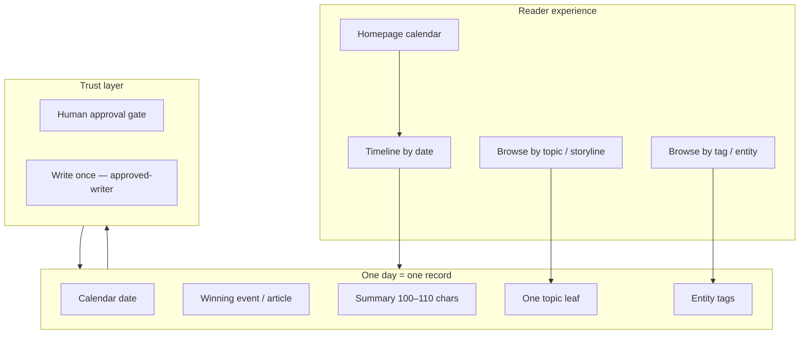

| Layer | Question it answers | If wrong… |
|-------|---------------------|-----------|
| **Date** | Did this happen *on this day*? | Timeline lies |
| **Event** | Is this the most important thing that day? | Wrong story on the slot |
| **Summary** | What happened, in one tight line? | Reader confusion |
| **Tags** | *Who / what* was involved? | Entity pages break |
| **Topic** | *What kind of story* is this? | Storyline browse breaks |
| **Approval** | Did a human sign off? | No trust |

---

## 2. The day record — fields and rules

| Field | DB / code | Hard rule | Who should decide (target) | Who decides (today) |
|-------|-----------|-----------|----------------------------|---------------------|
| `date` | `historical_news_analyses.date` | ISO day key | Calendar + canonical rules | Regex (Pizza Day) + optional LLM date agent |
| `top_article_id` | `top_article_id` | Real URL/id, not placeholder | Article Discovery Agent | LLM on empty days; existing row otherwise |
| `summary` | `summary` | 100–110 chars, active voice, no date tokens | Summary Agent + retry | LLM generates; pipeline validates |
| `tags_version2` | JSON array | Concrete entities, grounded in summary | Tag Agent + grounding rules | Entity extractor + `proposals.ts` rules |
| `topic_categories` | JSON array | **Exactly one** `TOPIC_HIERARCHY` leaf | **Topic Agent (LLM) + hierarchy guard** | **Regex map + you + validator stub** |
| `is_orphan` | flag | Cleared only after summary approval | Human summary gate | Mostly correct |
| `is_flagged` | flag | Manual issue marker | Human | Human |

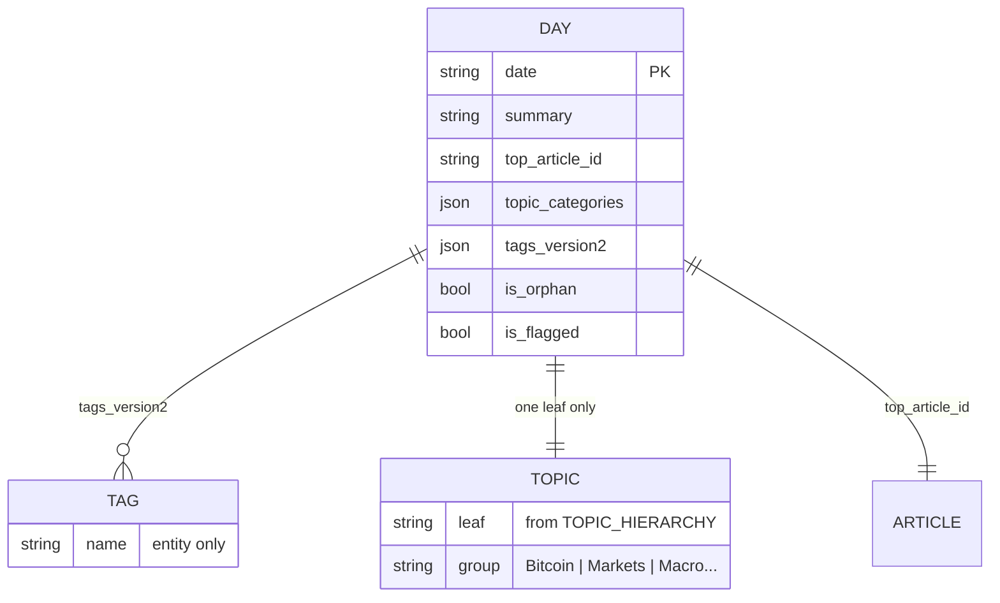

---

## 3. Triage — how a day enters the pipeline

**LLM today:** No. Pure rules in `triage.ts`.

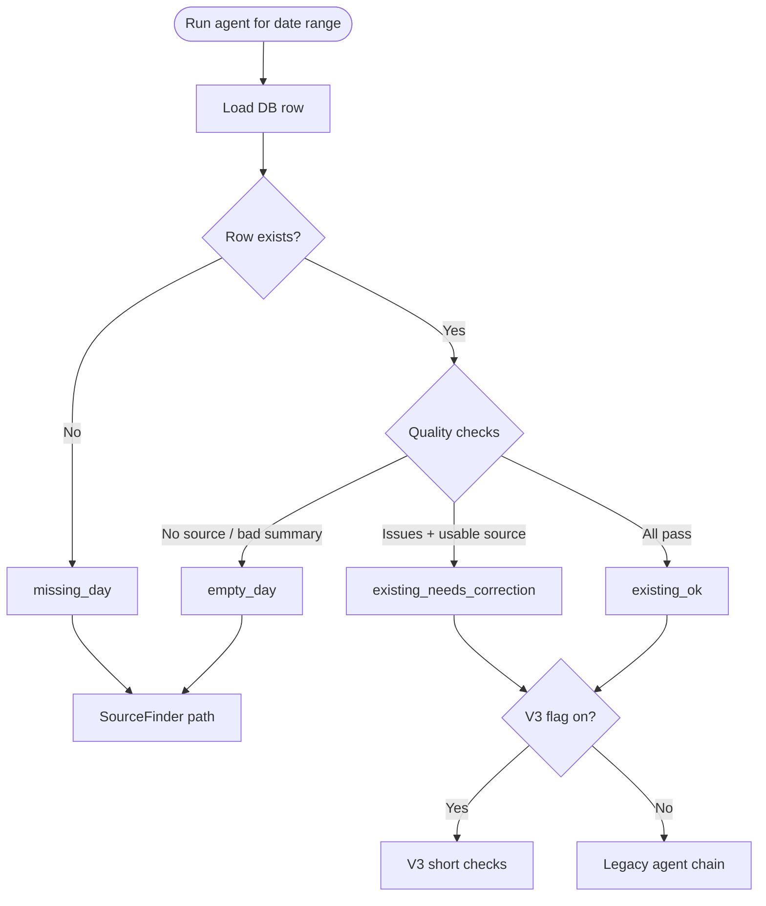

| Route | Meaning | Typical problems |
|-------|---------|------------------|
| `missing_day` | No `historical_news_analyses` row | Date never analyzed |
| `empty_day` | Row exists, no usable event/summary | Needs article search + summary |
| `existing_needs_correction` | Row exists, fails quality/topic/tag rules | Correction queue |
| `existing_ok` | Passes triage | May still fail duplicate/date on deeper check |

**Triage failure signals (examples):**

| Signal | Trigger |
|--------|---------|
| Summary weak | Not 100–110 chars, empty, or “Analysis failed.” |
| No winner | Invalid/missing `top_article_id` |
| Taxonomy missing | No tags and no topics |
| Topic invalid | 0, 2+, legacy placeholder, or not in hierarchy |
| Orphan / flagged | Row flags set |
| Low confidence | Stored score &lt; 60 |

---

## 4. Two pipelines today (the “two jokes”)

When `EDITORIAL_PIPELINE_V3_GATED_FETCH=1` (env flag), **existing days** take a different path than **empty days**. That split is a major source of confusion.

### 4a. V3 path (existing days)

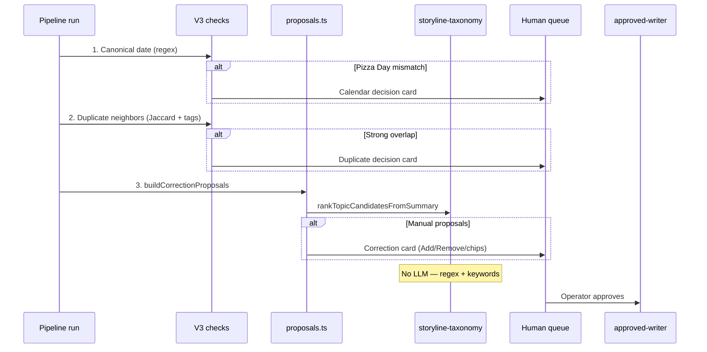

| V3 step | Intelligence type | What it “knows” |
|---------|-------------------|-----------------|
| Canonical date | **Hardcoded regex** | Only rules in `CANONICAL_DATE_RULES` (≈ Pizza Day) |
| Duplicate | **Statistics** | ±56 days, shared tags/topics, summary token Jaccard |
| Proposals | **Rules** | Grounding, tag conflicts, topic rank, summary length |
| Auto-apply | **Safe subset** | Drops/merges with no ambiguity |

### 4b. Legacy agent chain (empty / missing / V3 off)

```mermaid
flowchart LR
  NM[NewsManager<br/>route only] --> SF[SourceFinder<br/>LLM via newsAnalyzer]
  SF --> RC[RelevanceChecker<br/>rules]
  RC --> VF[Verification<br/>reads old verdicts]
  VF --> TM[TopicManager<br/>validator ONLY]
  TM --> TG[TagManager<br/>coverage check]
  TG --> SM[SummaryAgent<br/>validator ONLY]
  SM --> DC[DuplicateChecker<br/>Jaccard]
  DC --> DT[DateConsistency<br/>regex + LLM]
  DT --> TC[TagConsistency<br/>web2/web3]
  TC --> FE[FinalEditor<br/>gate]
  FE --> Q[Human queue]
```

**Critical naming lie:**

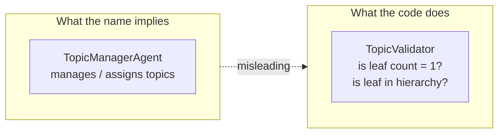

---

## 5. Topic assignment — today vs target (the spine)

Topics are how users browse **storylines**. This is the biggest gap between your spec and production.

### 5a. Today — three systems, none is a Topic Agent

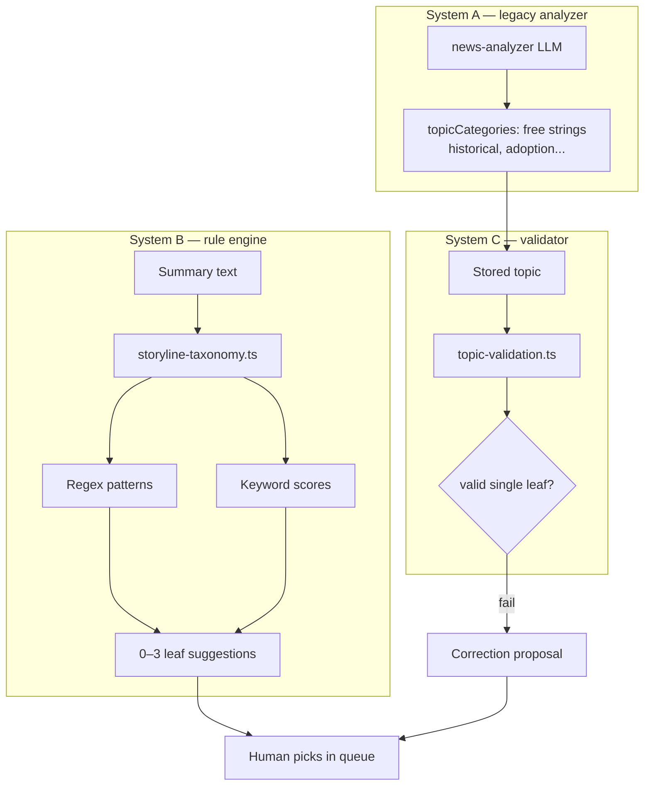

| Stage | LLM? | Input | Output | Example failure |
|-------|------|-------|--------|-----------------|
| Legacy analyze | Yes | Articles | Random category strings | `economic` on G20 day |
| `rankTopicCandidatesFromSummary` | No | Summary + tags | 0–3 hierarchy leaves | G20 → 2 macro options ✓ |
| Same rules | No | USPS summary | **Empty** — no labor pattern | 2009-08-26 |
| `TopicManagerAgent` | No | Stored topic | Pass/fail only | Does not fix `Soft forks` on USPS |
| Human | You | Full hierarchy dropdown | Final leaf | Works but slow |

### 5b. Target — Topic Agent as specified

From `TEST_JAN_2026_EDITORIAL_SCENARIOS.md` §8:

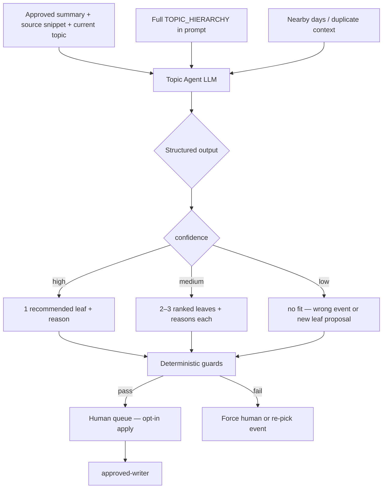

**Target JSON contract:**

| Field | Purpose |
|-------|---------|
| `recommended_topic` | Primary leaf (must ∈ hierarchy) |
| `alternates` | Up to 2 more leaves |
| `confidence` | high / medium / low |
| `reason` | Plain English tied to summary |
| `duplicate_risk` | low / medium / high |
| `human_review_required` | Always true for changes |

**Rules after LLM (guards, not brain):**

| Guard | Blocks |
|-------|--------|
| `invalidTopicReasons` | 0 topics, 2+ topics, legacy placeholders, unknown leaves |
| `storedTopicConflictsWithSummary` | Bitcoin topic with no Bitcoin in summary |
| Duplicate agent | Same storyline on nearby date |

---

## 6. Full agent roster — spec vs today vs target

| Agent (name in UI/logs) | Intended role | Today | Target | LLM target? |
|-------------------------|---------------|-------|--------|-------------|
| **NewsManager** | Orchestrate triage + handoffs | Routes + optional run blurb | Same + honest step plan | Optional narrative only |
| **MilestoneAgent** | Calendar milestone gaps | Rule scan | Same | No |
| **SourceFinder / Article Discovery** | Find + rank date-accurate events | LLM article pick + search | Ranked list + reasons + duplicate risk | **Yes** |
| **RelevanceChecker** | Crypto/Bitcoin relevance class | Summary length + article id | Full relevance taxonomy from spec | **Yes** (classify) |
| **VerificationAgent** | Fact-check signals | Reads stored verdicts | Active verification on demand | **Yes** (optional) |
| **SummaryAgent** | Own 100–110 char summary | **Validates only** | Generate + retry + escalate | **Yes** |
| **Tag Agent** | Propose tag add/remove | Extractor + proposals | Spec §7 with reasons | **Yes** + rules |
| **Topic Agent** | Assign storyline leaf | **Missing** — regex + validator | Spec §8 | **Yes** + guards |
| **Duplicate Agent** | Semantic duplicate detection | Jaccard + tag overlap | Spec §9 semantic check | **Mixed** |
| **Date Agent** | Calendar fit | Pizza regex; LLM in legacy only | All canonical rules + LLM | **Mixed** |
| **TopicManager** *(misnamed)* | — | Validator only | **Rename → TopicValidator** | No |
| **FinalEditor / Human gate** | Present diffs, collect approval | Improving UI | Spec §10 display format | No (presentation) |
| **approved-writer** | Apply approved deltas only | **Works** | Same | No |

### Capability maturity (0–3)

| Capability | Today | Target |
|------------|:-----:|:------:|
| Event discovery | 2 | 3 |
| Summary generation | 2 | 3 |
| Tag proposals | 2 | 3 |
| **Topic assignment** | **0–1** | **3** |
| Duplicate detection | 1 | 3 |
| Date / canonical | 1 | 3 |
| Human UX | 2 | 3 |
| Write integrity | 3 | 3 |

*0 = missing, 1 = brittle rules, 2 = usable with human, 3 = spec-complete*

---

## 7. Human review — state machine

Everything meaningful should land as **one understandable card**.

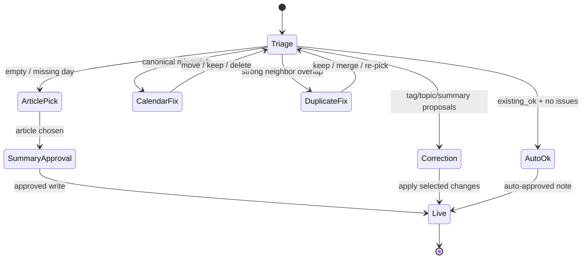

| Queue phase | What you decide | LLM involved in proposal? |
|-------------|-----------------|---------------------------|
| `awaiting_article_pick` | Which article is the event | Summary + tags: yes; topic: rules |
| `awaiting_summary_approval` | Final summary, tags, topics | Same |
| `awaiting_calendar_decision` | Wrong date slot | No (regex triggered) |
| `awaiting_duplicate_decision` | Same story twice | No (stats triggered) |
| `awaiting_correction_approval` | Add/remove tags, topic chips | **No — rules only today** |

---

## 8. Trust boundary — what may write to the DB

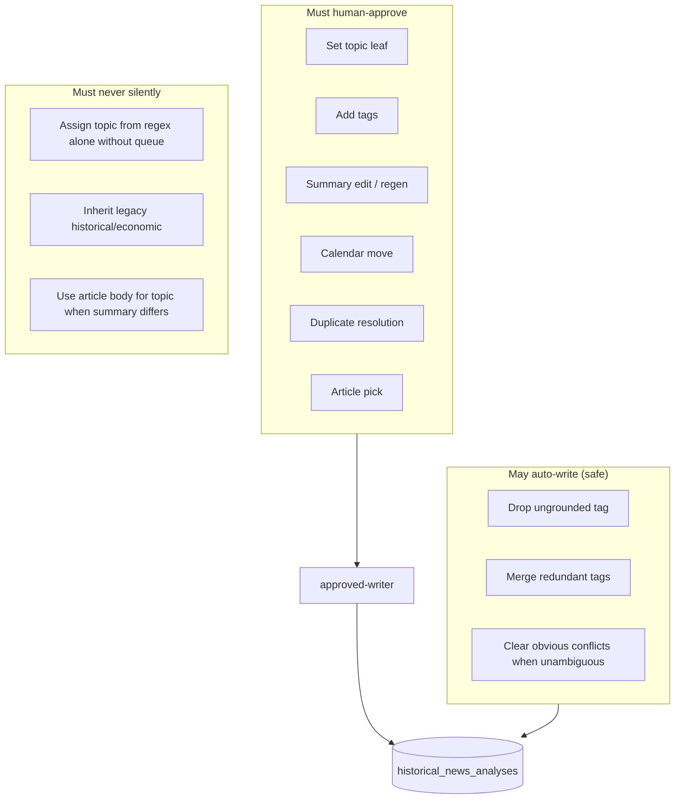

---

## 9. Example journeys (why you feel the pain)

### 2009-04-03 — G20 bailout (rules partially work)

| Step | What happens |
|------|----------------|
| Stored topic | `Early Bitcoin history` (wrong) |
| Summary | G20 $1.1T deal — macro, no Bitcoin |
| Rule engine | Flags conflict; suggests `Bailouts and stimulus` + `Global growth and recession` |
| You | Pick one chip → apply |
| Gap | Works **after** rule addition; still no LLM **reason** |

### 2009-08-26 — USPS buyouts (rules fail)

| Step | What happens |
|------|----------------|
| Stored topic | `Soft forks and hard forks` (nonsense) |
| Summary | USPS buyouts — labor/macro |
| Rule engine | **No pattern match** → empty suggestions |
| You | Full hierarchy dropdown — no help |
| Target Topic Agent | Should suggest `Labor market` or `Global growth and recession` with reason — or say “macro day, weak crypto link — confirm relevance” |

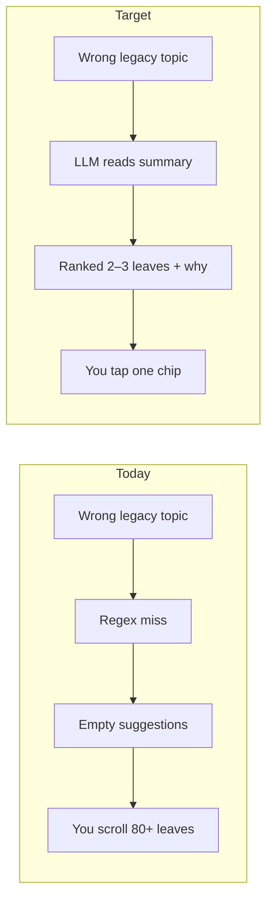

---

## 10. Where LLM runs today (actual call sites)

| Call site | File | Used for topics? |
|-----------|------|------------------|
| **Topic Agent** | `topic-agent.ts` | **Yes** — corrections, article pick, summary approval |
| Article + summary analyze | `news-analyzer.ts` | Legacy free strings only |
| Summary generation | `analysis-modes.ts` | No (`topicCategories: []`) |
| Entity tags | `entity-extractor.ts` | No |
| Date consistency verdict | `date-consistency-llm.ts` (+ `executors.ts`, V3 `run.ts`) | No |
| Run narrative | `run.ts` generateManagerNarrative | No |
| Tag v1 categorization | `tag-categorizer.ts` | **Different taxonomy** — not storyline |
| Rules fallback topics | `storyline-taxonomy.ts` | When Topic Agent disabled / no key |

**Env:** `TOPIC_AGENT_DISABLED=1` forces rules fallback. `EDITORIAL_V3_DATE_LLM=0` skips LLM date check on V3 (regex canonical rules still run).

---

## 11. Target unified pipeline (single path)

Replace V3 + legacy + three topic systems with **one graph**:

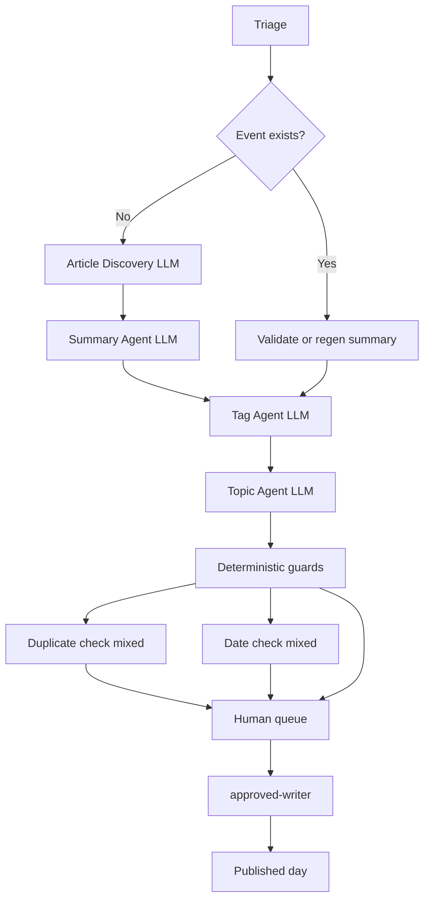

| Phase | LLM | Rules | Human |
|-------|:---:|:-----:|:-----:|
| Discover event | ✓ | date filters | pick if low confidence |
| Summary | ✓ | 100–110 enforcement | edit if fail |
| Tags | ✓ | entity allowlist | add/remove opt-in |
| **Topics** | **✓** | hierarchy membership | pick among ranked |
| Duplicate / date | partial | thresholds | calendar/dupe cards |
| Write | — | schema validation | already approved |

---

## 12. “Not a joke anymore” — measurable done criteria

| Metric | Today (estimate) | Target |
|--------|------------------|--------|
| Days with useful topic suggestion (chip or single rec) | ~40–60% on correction queue | **≥80%** |
| Legacy placeholder topics silently “valid” | Many old rows | **0** |
| Queue items with plain “why” from model | Rare (rule rationale only) | **100%** of topic changes |
| Steps logged as “Agent completed” with no logic | Common (validators) | **0** — rename or merge |
| Operator opens full topic dropdown | Often on macro/labor | **&lt;20%** of corrections |
| Topic assigned without human on meaningful change | Should not happen | **Never** |

---

## 13. Build roadmap (dependency graph)

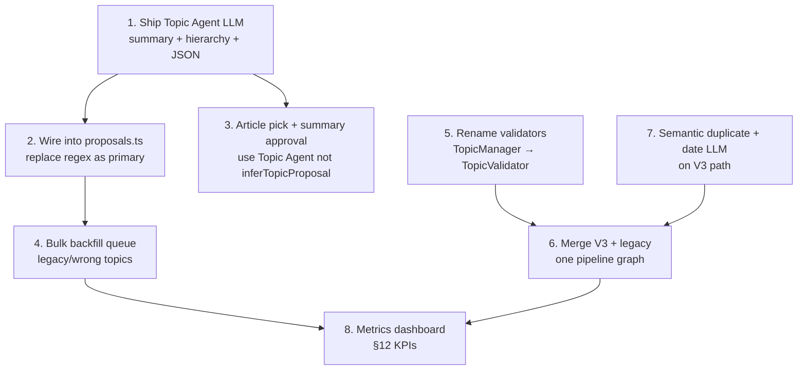

| Priority | Work | Status |
|:--------:|------|--------|
| **P0** | Topic Agent LLM | **Shipped** |
| **P1** | Deterministic guards | **Shipped** |
| **P2** | Unified existing-day pipeline | **Shipped** — all `existing_*` routes use corpus-clean graph |
| **P3** | `TopicValidatorAgent` naming | **Shipped** — `TopicManagerAgent` kept as legacy alias |
| **P4** | Bulk backfill | **Shipped** — `queue-topic-corrections.ts`, `dry-run-corpus-clean.ts --apply` |
| **P5** | Date + semantic duplicate on existing path | **Shipped** — `date-consistency-llm.ts`, `duplicate-agent-llm.ts` |
| **P6** | Tag Agent LLM | **Shipped** — `tag-agent.ts` in proposals |
| **P7** | §12 metrics | **Shipped** — `corpus-metrics.ts`, `corpus-metrics-report.ts` |
| Open | Metrics dashboard UI, Verification on demand, legacy chain removal | Future |

---

## 14. Honest summary

| Statement | True? |
|-----------|-------|
| You want a publishable Bitcoin/crypto history product | ✓ |
| Topics are the browse spine | ✓ |
| Human must approve meaningful writes | ✓ |
| Current pipeline is mostly validators + regex | ✓ (legacy path); V3 corrections use Topic Agent |
| Topic Agent from your spec is **not shipped** | **No** — v1 shipped (`topic-agent.ts`, wired in proposals + approved-writer) |
| Recent “improvements” = better rules + UI, not LLM topics | **Partially outdated** — rules + UI remain; LLM topics now primary when enabled |
| Calling that full agent intelligence was misleading | ✓ for pre-P0; post-P0 topic step is real LLM with human gate |

**North star:** `understand event → recommend bucket with proof → you approve → write once`

**Not north star:** `more regex → pretend TopicManager assigned it`

**Still open:** unified pipeline, Tag/Relevance LLM agents, semantic duplicate on V3, validator renaming, §12 metrics.

Until those ship, the system is an **editorial queue with real topic LLM + good gates** — not yet the full multi-agent product you designed.
