# Editorial pipeline: scenarios, agent graph, and human role

This document describes how the **editorial pipeline** (v2) behaves in the codebase: triage routes, agent order, DB artifacts, human review, **short-circuit on reject** (default), **resume-slice** API, and **target** closed-loop UX still to build.

**Sections:** graph and routes (§§1–4) · human role (§5) · scenarios (§6) · reject vocabulary (§7) · **target** closed-loop design (§8) · **HTTP API index** (§9) · **implemented** operator snapshot, env, resume-slice (§10) · file references (§11).

---

## 1. Big picture

Each **pipeline run** covers a date range (with a cap on how many calendar days are processed). For **each day** in that range:

1. **Triage** (`triage.ts`) assigns exactly one **route** (`existing_ok`, `existing_needs_correction`, `empty_day`, or `missing_day`) and a **fixed ordered list** of agents (`requiredAgents`).
2. The runner (`run.ts`) records a synthetic **NewsManager** step (triage outcome), then runs each agent in order: normally **`requiredAgents`** from triage; for a **slice re-run** (§§9–10) only **`partialRun.agents`** (a suffix of that chain).
3. At the end of that day, a row is inserted into **`human_review_queue`** (unless the day was **auto-approved** — see §5).
4. **Reject / error short-circuit:** unless `EDITORIAL_PIPELINE_SHORT_CIRCUIT_ON_REJECT=0`, the runner **stops** the per-day agent chain after the first **`rejected`** or **`error`** step (later agents are not run). See **§§9–10**. Set the env var to **`0`** to restore the legacy “run the full chain anyway” behavior.

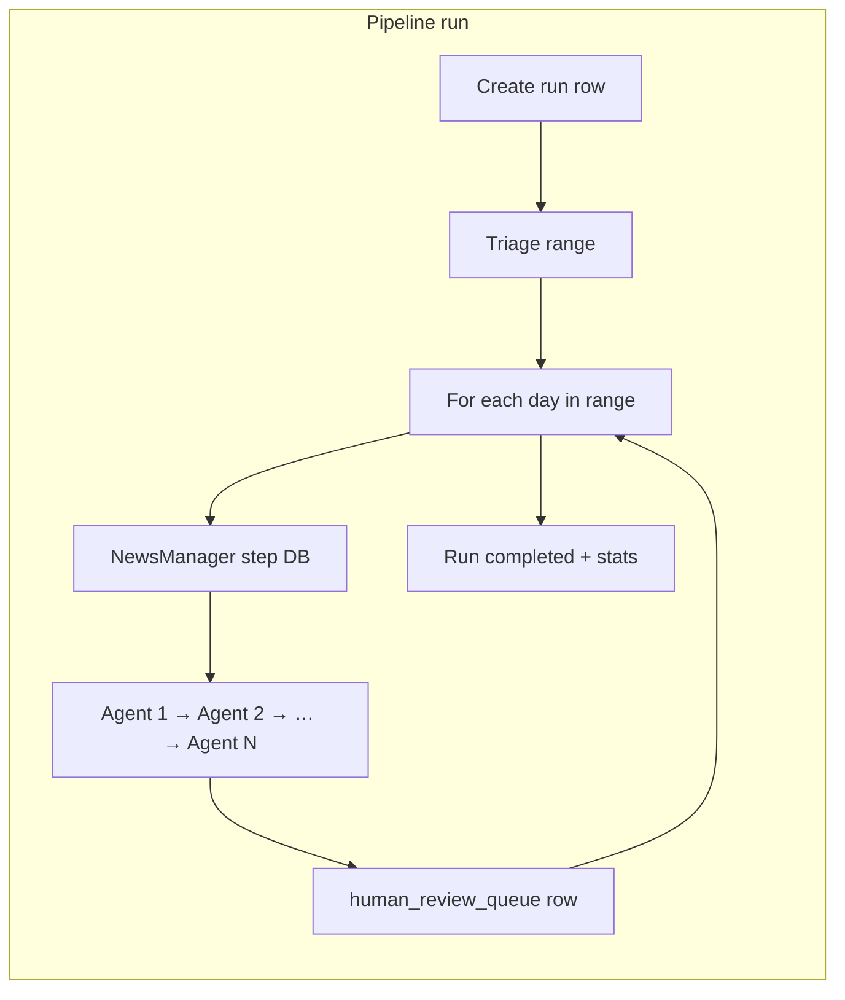

---

## 2. Where triage sends a day (routes)

Triage inspects the **`historical_news_analyses`** row for that calendar date (and tag link counts via **`pages_and_tags`**). Routes:

| Route | Meaning (simplified) |
|--------|----------------------|
| **`missing_day`** | No analysis row exists for that date. |
| **`empty_day`** | Row exists but **no fetched articles** *or* **summary is weak** (&lt; 80 chars after trim), *or* triage chose this branch from other rules (see code). |
| **`existing_needs_correction`** | Row exists, but triage found quality issues (flagged, orphan, no articles, weak summary, low confidence, missing taxonomy, etc.) while **not** falling into the strict `empty_day` branch. |
| **`existing_ok`** | Row looks healthy for automated checks: summary length, confidence, articles fetched, taxonomy signals present, not flagged/orphan per rules. |

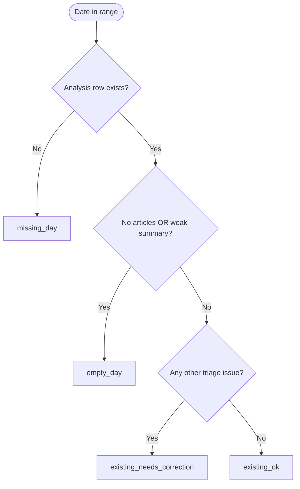

Days are **ordered for processing** by priority: `missing_day` → `empty_day` → `existing_needs_correction` → `existing_ok` (see `prioritizeTriage`).

### 2.1 `existing_ok` is a **pre-flight label**, not “editorially approved”

Easy confusion: if triage chose **`existing_ok`** but **DateConsistencyAgent** (or any later agent) **rejects**, the day was **not** “passed” in any final sense.

| Concept | What it means |
|--------|----------------|
| **`triage.route` (e.g. `existing_ok`)** | Chosen **once**, before agents run, from **DB heuristics** (summary length, articles fetched, taxonomy present, scores, flags). It picks **which agent chain** to run. It is **not** recomputed when an agent rejects (except the special **`empty_day` → retriage** path before queue insert — §5.3). |
| **Step status (`rejected`, …)** | What actually happened when an agent ran. Recorded on **`pipeline_steps`**. |
| **Editorial “pass” today** | Either **`human_review_queue.status = approved`** (you or policy) or the rare **`auto`** row when auto-approve rules all pass (§5.2). |

So for a “healthy-looking” row, you can still see **`existing_ok`** in the review **package** while **DateConsistency** shows **`rejected`**: the label means “we used the short check-only chain,” not “date checks agreed.” **Auto-approve is blocked** in that case; the queue row should be **pending** until a human (or a future workflow) resolves it.

---

## 3. Agent chains per route (fixed order)

Handoffs in the DB are built from **NewsManager → each agent** in `requiredAgents`, but **execution** follows the **array order** below (sequential).

### 3.1 `existing_ok` (healthy day — “check only” path)

**Order:**

1. NewsManager *(synthetic step: triage only)*  
2. DuplicateCheckerAgent  
3. DateConsistencyAgent  
4. TagConsistencyAgent  
5. FinalEditorAgent  

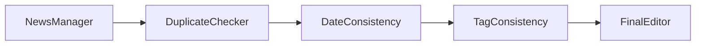

### 3.2 `empty_day` (needs sources + summary from scratch)

**Order:**

1. NewsManager  
2. SourceFinderAgent  
3. RelevanceCheckerAgent  
4. VerificationAgent  
5. SummaryAgent  
6. DuplicateCheckerAgent  
7. DateConsistencyAgent  
8. TagConsistencyAgent  
9. FinalEditorAgent  

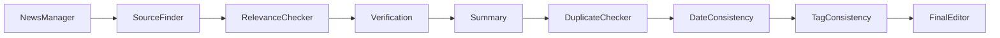

### 3.3 `existing_needs_correction` (content/taxonomy work before re-check)

**Order:**

1. NewsManager  
2. VerificationAgent  
3. TopicManagerAgent  
4. TagManagerAgent  
5. SummaryAgent  
6. DuplicateCheckerAgent  
7. DateConsistencyAgent  
8. TagConsistencyAgent  
9. FinalEditorAgent  

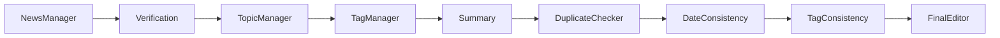

### 3.4 `missing_day` (no row yet — full build)

**Order:**

1. NewsManager  
2. MilestoneAgent  
3. SourceFinderAgent  
4. RelevanceCheckerAgent  
5. VerificationAgent  
6. SummaryAgent  
7. DuplicateCheckerAgent  
8. DateConsistencyAgent  
9. TagConsistencyAgent  
10. FinalEditorAgent  

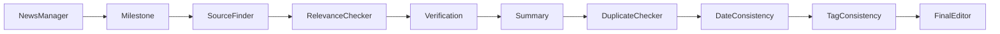

### 3.5 Agents defined in contracts but not in these triage chains

`TopicApplierAgent` and `TagApplierAgent` exist in the **pipeline agent enum** (`contracts.ts`) but are **not** currently inserted by `triage.ts` into `requiredAgents`. They are reserved for future or alternate flows.

---

## 4. How agents “connect” in the database (observability)

For **each** executed agent step, the runner:

- Inserts **`pipeline_steps`** (status, confidence, rejection fields, JSON input/output).
- May insert **`pipeline_evidence`**.
- Appends **`pipeline_confidence_history`**.
- Inserts a **`pipeline_handoffs`** row **to** that agent (payload includes route, reasons, date, analysis id).
- Inserts a **`pipeline_handoffs`** row from that agent **back to NewsManager** with a generic “completed / needs_review” style payload — this is mainly for **traceability**, not a live loop that replans work.

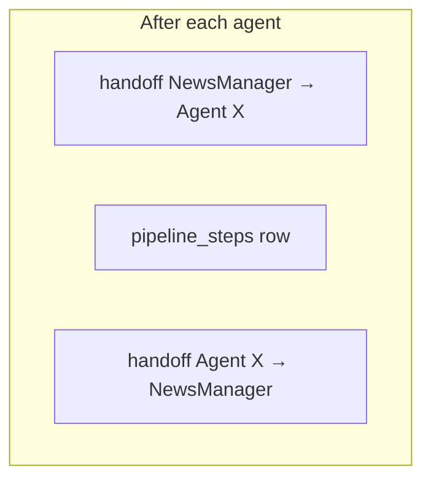

There is **no** automatic graph traversal: the next agent is simply the **next name** in the list being executed (`requiredAgents` from triage, or **`partialRun.agents`** for a slice-only run — §§9–10).

---

## 5. Where you stand as a human

### 5.1 Three surfaces

| Surface | Your role |
|---------|-----------|
| **Admin → Pipeline** | Start runs, pick dates/range, watch **steps** and handoffs. This is the **technical trace**. |
| **Admin → Human review** | Act on **`human_review_queue`**: approve or reject packages; read triage + notes. |
| **Day / analysis UI elsewhere** | Editing the underlying day still goes through your normal product flows; the pipeline does **not** automatically rewrite published copy unless you have separate wiring for that outside this document’s scope. |

### 5.2 What happens at the end of each day

After all agents for that day have run:

- A **`human_review_queue`** row is created with a **JSON `package`** containing **triage** (and sometimes `initialTriageRoute` if re-triage changed things — see below). The **`triage.route`** in that package is still the **initial** classification (e.g. `existing_ok`); it does **not** flip to “failed” when an agent rejects — see **§2.1** for why that can look contradictory next to a red DateConsistency step.
- **Auto-approve** (queue row created as **approved** by `"auto"`) happens **only** when:
  - initial route was **`existing_ok`**, **and**
  - **no** step had status **`rejected`** or **`error`**, **and**
  - **no** step had status **`skipped`**.

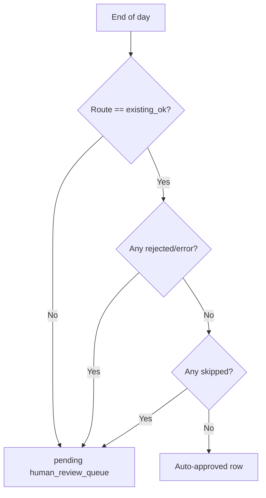

So: **with default short-circuit** (§1, §10), a **reject/error** stops further agents for that day but still forces **pending** human review when auto-approve is blocked. **With** `EDITORIAL_PIPELINE_SHORT_CIRCUIT_ON_REJECT=0`, the legacy behavior applies: the runner continues through the rest of the chain even after a reject/error; rejections still block auto-approve for `existing_ok`.

### 5.3 Special case: `empty_day` re-triage before queue insert

If the day started as **`empty_day`**, the runner may call **`retriageSingleExistingDate`** after agents (e.g. after sources/summary were updated) and use the **refreshed** triage in the queue package when `analysisId` is present. The queue note can mention initial vs re-evaluated route.

### 5.4 Retries (operator-visible)

`run.ts` retries an agent **at most once more** (two attempts total) when the step status is **`rejected`** or **`error`**. After the second failed attempt: if **short-circuit is on** (default), the per-day loop **exits** without running subsequent agents; if short-circuit is **off** (`=0`), execution **continues** to the next agent in the chain.

---

## 6. Scenario matrix (what you should expect)

Legend: **Queue** = `human_review_queue` row. **Trace** = pipeline steps you see in Admin.

| Scenario | Typical route | Trace | Queue default | Auto-approve? |
|----------|---------------|--------|-----------------|---------------|
| Healthy day, all agents pass | `existing_ok` | Full chain, all completed | pending unless auto | **Yes** if no reject/error/skip |
| Healthy day, DateConsistency rejects | `existing_ok` | Later agents **skipped** if short-circuit on (default); full chain if `EDITORIAL_PIPELINE_SHORT_CIRCUIT_ON_REJECT=0` | **pending** | **No** |
| Healthy day, DuplicateChecker skips | `existing_ok` | skip shows in trace | **pending** | **No** (skip blocks auto) |
| No analysis row | `missing_day` | Long chain (incl. Milestone + SourceFinder…) | **pending** | No |
| Row exists, no articles / weak summary | `empty_day` | Long chain | **pending** (note may mention re-triage) | No |
| Row exists, quality issues | `existing_needs_correction` | Correction chain | **pending** | No |

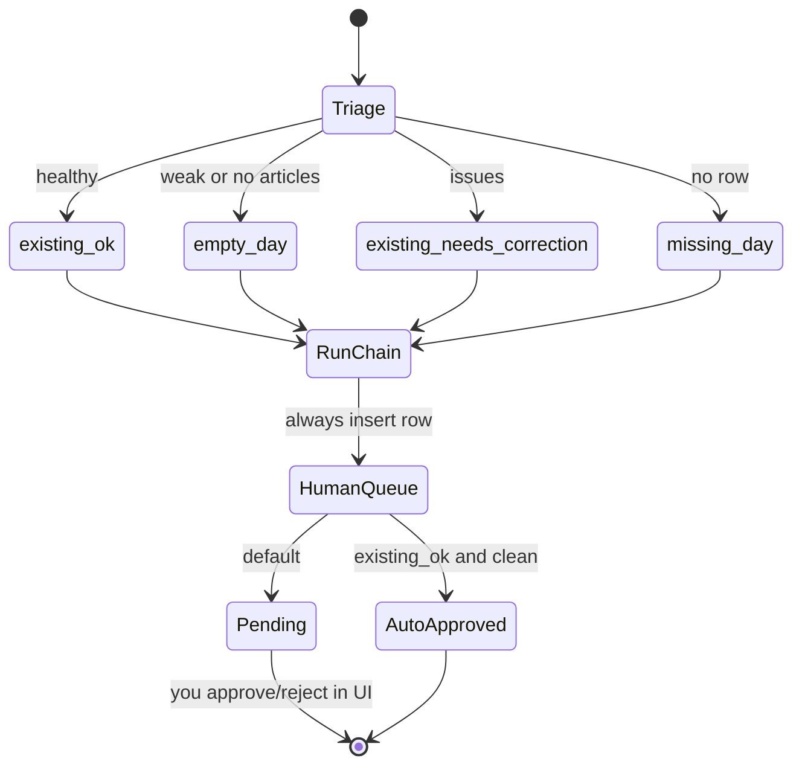

---

## 7. Rejection vocabulary (what agents can suggest)

When a step rejects, structured output can include **`suggestedAction`** (enum in `contracts.ts`):

- `retry_with_new_source`
- `manual_review`
- `discard`
- `merge_existing`

and **`returnTo`** (another agent name) in the schema — the runner does **not** yet jump to that agent automatically; it is guidance for **you**, the **resume-slice** API (§9), or future UI. The first structured blocker is copied into **`package.operatorSnapshot.firstBlocker`** on the human-review row when present (§10.3).

---

## 8. Target: human-in-the-loop closed loop (design)

This section describes the **full product vision** (modal decisions, automatic `returnTo` routing, post-run reassessment). Parts of it are **already implemented**: default **short-circuit on reject**, **`operatorSnapshot`** on review packages, **`GET resume-options`** / **`POST resume-slice`**, and **`pipeline_runs.config`** flags — see **§10**. Remaining gaps vs this vision are summarized in **§8.7**.

### 8.1 Design goals

1. **You always know “where we are”** — one screen summarizes phase, calendar date, analysis id, triage route, and the **frontier agent** (last completed / first blocking).
2. **You see why we stopped** (if we stopped) — primary blocker: first `rejected` / `error`, or policy stop after `skipped` when that implies ambiguity.
3. **You choose among safe next moves** — each option shows **preconditions**, **cost** (time/tokens), and **what gets re-verified** after.
4. **No silent graph walks** — the system never runs a long chain without either a successful auto-path or your confirmation for expensive branches.

### 8.2 “Current state” the UI should synthesize

Think of an **operator snapshot** (not necessarily one DB row) assembled from:

| Field | Source (today) | Purpose |
|--------|----------------|--------|
| **Event date** | `human_review_queue.event_date` / triage | Anchor |
| **Analysis id** | triage / row | Mutations attach here |
| **Triage route** | `package.triage.route` | Which *initial* chain was chosen (§2.1) |
| **Triage reasons** | `package.triage.reasons` | Why that route |
| **Frontier** | Latest `pipeline_steps` in order | “We got through X; Y is next or blocked here” |
| **Blockers** | All `rejected` / `error` steps (ordered) | Often one primary + secondary noise |
| **Suggestions** | `rejectionReason`, `suggestedAction`, structured output; **`package.operatorSnapshot`** (§10.3) | Drives **decision cards** and resume-slice choices |
| **Open human actions** | `human_review_queue.status` | pending / approved / rejected |

**Primary vs secondary blockers:** with **short-circuit on** (default), agents **after** the first `rejected` / `error` are **not** run for that day, so the trace has a single causal failure (unless a later day in the same run fails separately). With short-circuit **off**, later agents may still run; the UI should still treat the **first** rejection as the main gate for that day.

### 8.3 Operator-facing phases (target)

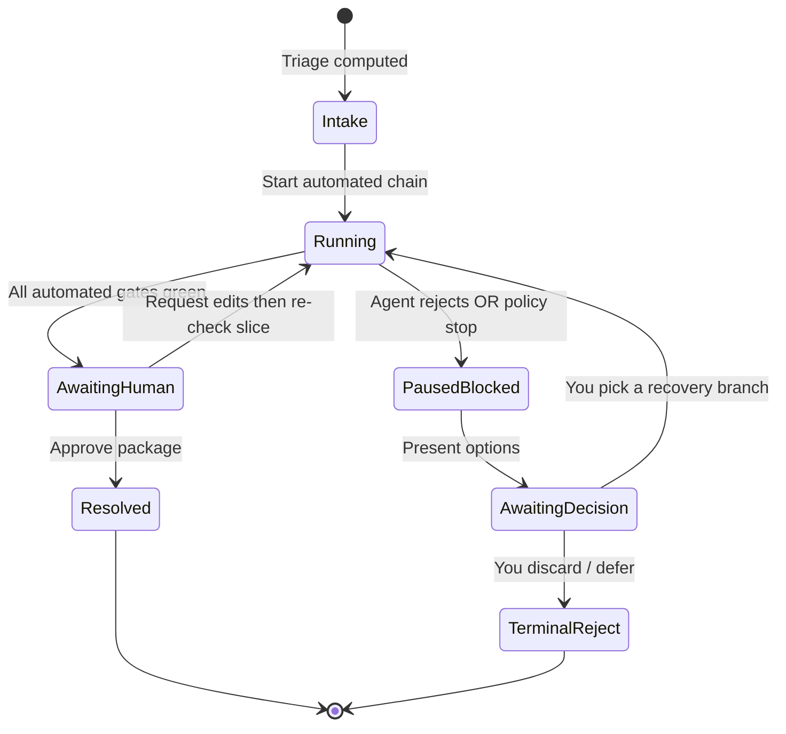

- **Intake** — triage label + reasons (you may override route *before* run in a future UI).
- **Running** — live step feed; optional cancel.
- **PausedBlocked** — chain halted; blocker card expanded by default.
- **AwaitingDecision** — **this is the “closed loop” moment**: current state + **2–5** explicit buttons (see §8.4).
- **AwaitingHuman** — no hard blocker; you still approve merge to production narrative if required by policy.

### 8.4 Decision cards: map structured rejections → directions

Agents already emit **`suggestedAction`** and **`returnTo`** (`contracts.ts`). A target UI would translate those into **cards** with copy you can act on.

| `suggestedAction` | Typical meaning | Example directions you might see |
|-------------------|-----------------|----------------------------------|
| **`retry_with_new_source`** | Evidence weak or stale | “Re-run **SourceFinder** → downstream verification” (only if allowed for this route); “Open manual source picker” |
| **`merge_existing`** | Duplicate or wrong calendar slot vs canonical story | “Merge into **existing analysis date** `YYYY-MM-DD`” (then re-run **Duplicate → Date → Tag** slice) |
| **`manual_review`** | Model refuses automation | “Edit summary in CMS, then **re-run from Verification**” or “Send to senior editor” |
| **`discard`** | Day should not ship | “Mark day inactive / remove from publication set” |

**Cross-cut with `returnTo`:** if rejection says `returnTo: SummaryAgent`, the card should say: “After you approve, restart at **Summary** and re-run **Summary → Duplicate → Date → Tag → Final**” (exact slice depends on which outputs changed).

**Cross-cut with triage route:**

- **`existing_ok`** — recovery options should **not** assume long `SourceFinder` unless you explicitly opt in (“Treat as empty day” = escalate chain).
- **`empty_day` / `missing_day`** — `retry_with_new_source` is natural; merging may not apply.
- **`existing_needs_correction`** — prefer branches that touch **Verification / Topic / Tag / Summary** before duplicate/date again.

### 8.5 After you choose: “re-run slices” (target)

Instead of always running the full `requiredAgents` list, a closed-loop runner would support **subgraphs**:

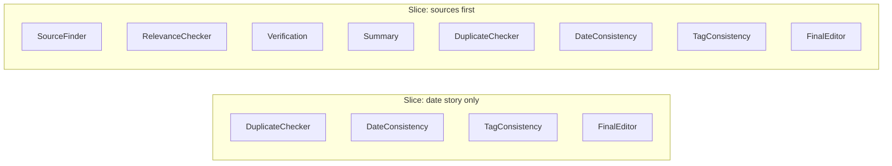

**Examples:**

- You fixed **taxonomy only** in DB → rerun **TagConsistency → FinalEditor** (or **TagManager → …** if on correction path).
- You accepted **merge to another date** → apply DB move → rerun from **DuplicateChecker** forward on **both** affected dates.
- You asked for **new articles** → **SourceFinder → …** then only downstream checks.

Each slice should display **before you confirm**: “Agents to run: … · Estimated relative cost: …”

### 8.6 Information hierarchy (what to show when)

**Always visible (collapsed ok but one glance):**

- Date, route, frontier agent, blocker badge, queue status.

**Expanded by default when PausedBlocked:**

- Verbatim primary rejection reason + structured fields (suggested date, neighbor id, etc.).

**On demand:**

- Full JSON step I/O, evidence URLs, raw handoffs.

**When AwaitingDecision:**

- **Current state** paragraph (auto-generated in plain language from snapshot).
- **Directions** as buttons; disabled state explains missing preconditions (“Add analysis row before merge”).

### 8.7 Contrast with today (gap list)

| Area | Today | Target closed loop |
|------|--------|---------------------|
| Stop on reject | **Default:** yes — first `rejected`/`error` stops the day chain (`EDITORIAL_PIPELINE_SHORT_CIRCUIT_ON_REJECT` unset or non-`0`). Legacy: set env to `0` | Halt at first hard reject (or configurable) |
| Operator choice | Human review + **`GET resume-options`** / **`POST resume-slice`** (§9); no in-run blocking modal yet | Explicit **recovery** actions before final approve |
| `triage.route` vs reality | Initial label kept in package; **`package.operatorSnapshot`** adds blockers / slice hints | Optionally **append** `postRunAssessment` or re-triage more often |
| `returnTo` / `suggestedAction` | Stored on steps + **`operatorSnapshot.firstBlocker`** | Fully wired to **allowed transitions** + slice executor |
| Cost control | Slice re-run via **`POST /api/agent/pipeline/resume-slice`** (§9–§10) | You approve expensive branches in UI |

---

## 9. Pipeline HTTP API (`/api/agent/pipeline/*`)

All routes below are implemented in **`server/routes/agent-review.ts`** and use the same **agent secret** authentication as the rest of the agent API (`requireAgentSecret`).

| Method | Path | Summary |
|--------|------|---------|
| POST | `/api/agent/pipeline/run` | Start a date-range run (`dateFrom`, `dateTo`, `maxDaysToConsider`). |
| GET | `/api/agent/pipeline/runs/:id` | Run row + ordered **`pipeline_steps`** + **`pipeline_handoffs`**. |
| POST | `/api/agent/pipeline/runs/:id/stop` | Abort if the run is still active in this server process. |
| POST | `/api/agent/pipeline/runs/:id/pause` | Abort + mark run **`paused`** in the database. |
| POST | `/api/agent/pipeline/runs/:id/resume` | Start a **new** run for the same date window (re-triage + full chains; not the same as resume-slice). |
| GET | `/api/agent/pipeline/resume-options?date=YYYY-MM-DD` | Returns **`{ triage, resumeStartsAvailable }`** for building slice buttons. |
| POST | `/api/agent/pipeline/resume-slice` | Body: **`{ date, startAgent, requestedBy? }`** — new single-day run, suffix chain only (§10). |
| POST | `/api/agent/pipeline/shadow-validate` | Triage-only stats for a window (no executor steps). |
| GET | `/api/agent/pipeline/milestones/gaps` | Milestone gap scan (`dateFrom` / `dateTo` query params). |
| GET | `/api/agent/pipeline/cutover-status` | Flags, default model, **`shortCircuitOnReject`**. |
| GET | `/api/agent/pipeline/runs/:id/evidence` | Step-level evidence payload. |
| GET | `/api/agent/pipeline/review?status=&limit=` | **`human_review_queue`** rows. |
| POST | `/api/agent/pipeline/review/:id/approve` | Approve pending item; runs **`executeApprovedReviewItem`**. |
| POST | `/api/agent/pipeline/review/:id/reject` | Reject pending item. |

---

## 10. Implemented: short-circuit, operator snapshot, resume-slice

### 10.1 Environment

| Variable | Effect |
|----------|--------|
| **`EDITORIAL_PIPELINE_ENABLED`** | Pipeline disabled when set to **`0`** (`startEditorialPipelineRun` throws). |
| **`EDITORIAL_PIPELINE_SHORT_CIRCUIT_ON_REJECT`** | If unset or any value other than **`0`**, the runner **breaks** the per-day loop after the first agent step with status **`rejected`** or **`error`**. Set to **`0`** to run the **full** `requiredAgents` list regardless (legacy). |

`GET /api/agent/pipeline/cutover-status` includes **`shortCircuitOnReject`** (and nested under `cutoverReadyChecks`) so the admin UI can show the active mode.

### 10.2 `pipeline_runs` row and NewsManager evidence

Each run stores **`config`** (JSON) including:

- **`maxDaysToConsider`**, **`mode`**, **`preserveExistingSearchAndSummary`**, **`resumedFromRunId`**
- **`partialRun`**: `{ date, agents }` when this run is a **slice re-run** (from **`POST resume-slice`**), else `null`
- **`shortCircuitOnReject`**: bool snapshot at run creation time

The synthetic **NewsManager** step’s **`evidence`** JSON includes **`requiredAgents`** (full triage chain), **`executedAgents`** (what this run actually ran, including slice suffixes), and **`partialRun`**: boolean.

### 10.3 `human_review_queue.package.operatorSnapshot`

Each queue row’s `package` JSON may include:

- **`shortCircuitOnReject`** — bool, mirrors env at run time.
- **`shortCircuited`** — true if the day stopped early because of reject/error while agents remained.
- **`firstBlocker`** — `{ agent, reason?, suggestedAction? }` for the first reject/error, if any.
- **`resumeStartsAvailable`** — ordered agent names from the **full** triage chain where a slice re-run may start (subset of anchors: Verification, Topic/Tag managers, Summary, Duplicate, Date, Tag consistency, Final editor — see `slice-resume.ts`).
- **`executedAgentSteps`** / **`scheduledAgentSteps`** — counts for that day’s chain (after any partial override).
- **`partialRun`** — if this run was a slice-only execution: `{ date, agents }`.

### 10.4 `resume-slice` request details

- **`startAgent`** must be a valid **`pipelineAgentSchema`** enum value **and** appear in that date’s triage **`requiredAgents`** **and** be a supported slice anchor (see **`slice-resume.ts`**). Otherwise the API responds with **400** and an error message.
- **`GET resume-options`** returns **400** when there is no triage row for the date (e.g. no analysis in range); other failures may return **500**.

### 10.5 Flow (mermaid)

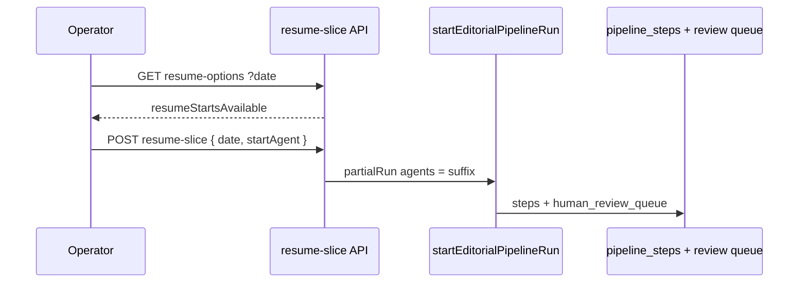

---

## 11. File references

| Concern | File |
|---------|------|
| Routes and `requiredAgents` | `server/services/editorial-pipeline/triage.ts` |
| Run loop, queue insert, auto-approve, resume-slice | `server/services/editorial-pipeline/run.ts` |
| Slice anchor helpers | `server/services/editorial-pipeline/slice-resume.ts` |
| Agent names, rejection/handoff shapes | `server/services/editorial-pipeline/contracts.ts` |
| Per-agent behavior | `server/services/editorial-pipeline/executors.ts` |
| HTTP routes | `server/routes/agent-review.ts` |

---

*Update this doc when `triage.ts`, `run.ts`, `slice-resume.ts`, or `agent-review.ts` change. §8 describes additional UX (modal decisions, postRunAssessment, auto `returnTo`) not fully implemented.*
