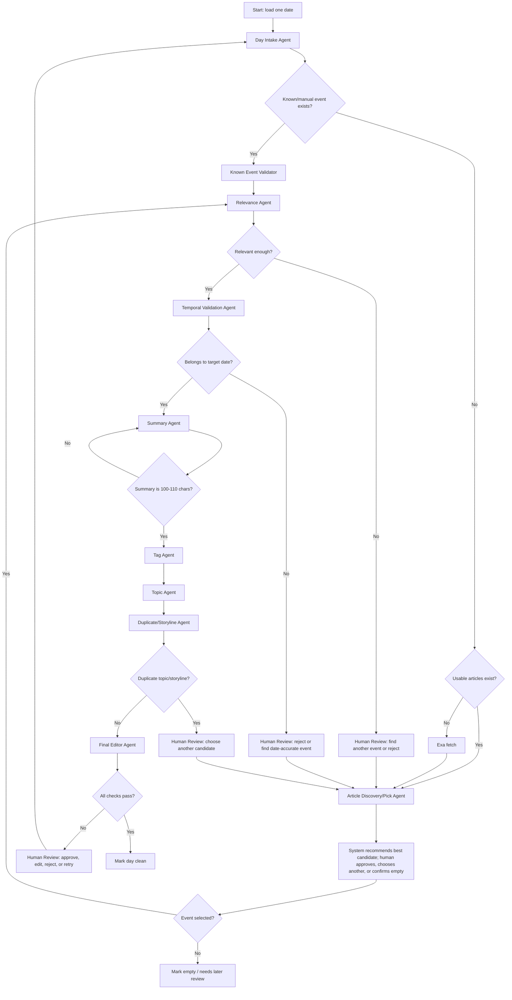

# January 2026 - editorial cleanup scenarios

This document is the source of truth for how the January 2026 cleanup test should behave.
It describes the expected database state, triage route, agent responsibilities, and human review flow for each day.

The goal is not just to summarize articles. The goal is to clean the historical database so every day has a valid, date-accurate, relevant record with a correct summary, topic, and tags.

---

## Core Rules

### Implementation anchors

Current behavior should be checked against:

- `server/services/editorial-pipeline/triage.ts` for triage routing.
- `editorial-quality.ts` for summary weakness/quality helpers.
- `human_review_queue.package.triage.route` for stored route evidence.
- `package.phase` and `reviewPhase` for the Agents V2 queue phase strip.

This document intentionally replaces the old "under 80 characters is weak" planning shortcut with the cleanup rule below: summaries outside 100-110 characters require correction.

### 1. A day does not always need fetched articles

Some dates are known/manual historical events, such as Bitcoin Pizza Day on 2010-05-22. These records may be valid without fetched articles.

If a day already has a known/manual event:

- Do not force Exa fetch.
- Validate that the event objectively belongs to the date.
- Validate the summary, topic, tags, duplicate status, confidence, and flags.

If the day has no usable known/manual event and no usable article:

- Fetch candidate articles/events from Exa.
- Recommend the best candidate based on date accuracy and relevance, then ask the human reviewer to approve it, choose another, or confirm the day is empty.

### 2. The event does not have to be Bitcoin-only

Priority order:

1. Bitcoin-specific historical event.
2. Broader crypto, blockchain, or Web3 event.
3. Regulatory, market, or macroeconomic event that meaningfully affected Bitcoin or crypto.

The record should be rejected or sent to human review if relevance is weak or unclear.

### 3. The event must belong to the date

The system must distinguish between:

- an event that happened on the date, and
- an article published on the date that talks about an older event.

Example failure: an article in 2020 mentions Bitcoin Pizza Day, and the model incorrectly treats Pizza Day as a 2020 event.

If the article is retrospective, the record must either:

- summarize the actual event that happened on the target date, or
- be rejected for that date.

### 4. Summary length is a hard rule

Valid summaries must be 100-110 characters.

Anything below 100 or above 110 characters should be flagged for correction.

The summary should also:

- use active voice,
- describe the actual event clearly,
- avoid placeholders and failure phrases,
- avoid claiming an old event happened on the article publication date.

### 5. Tags and topics must match the event

Tags should describe the event and summary.
Topics should place the day inside the correct storyline/taxonomy.

The system may propose tag/topic changes, but meaningful changes should go through human review before being applied.

### 6. Duplicate topic/storyline rejection loops back to selection

If the selected event/topic duplicates an existing topic or storyline, the system should not force the duplicate through.

Instead, it should return to article/news selection and suggest another candidate event that still fits the historical storyline.

The replacement event should remain relevant to Bitcoin, crypto/Web3, regulation, markets, or macro context.

---

## Cleanup Flow



---

## Agent Map

| Agent | LLM? | Access | Guardrails |
| --- | ---: | --- | --- |
| Day Intake Agent | No | One date's database rows: articles, summary, tags, topic, flags, confidence, manual/known status | Classifies state only; does not rewrite content |
| Known Event Validator | Yes | Existing event, target date, source notes, manual/known flag | Verifies the event belongs to the exact date; must not invent facts |
| Article Discovery/Pick Agent | Mixed | Exa results, existing articles, database article candidates | Ranks and explains candidates; human chooses final article/event |
| Relevance Agent | Yes | Event/article text, summary, relevance criteria | Classifies as Bitcoin, crypto/Web3, macro-relevant, or irrelevant |
| Temporal Validation Agent | Yes | Target date, article date, event text, article body, summary | Rejects retrospective articles treated as present-day events |
| Duplicate/Storyline Agent | Mixed | Existing topics, storylines, topic usage, candidate event/topic | Uses deterministic duplicate lookup first; LLM explains semantic duplicate risk |
| Summary Agent | Yes | Approved event/article/manual event, style rules, current summary | Must produce 100-110 characters, active voice, no placeholders, date-accurate |
| Tag Agent | Yes | Approved event, summary, tag taxonomy, current tags | Suggests add/remove tags; cannot silently apply meaningful changes |
| Topic Agent | Mixed | Topic taxonomy, current event/summary, existing topic usage | Suggests best topic; rejects duplicate topic/storyline when needed |
| Human Review Agent | No | Proposed changes, reasons, confidence, before/after values | Always shows a proactive recommended action in plain language, then asks for approval |
| Final Editor Agent | Yes | Full package: event, source/manual status, summary, tags, topic, validations | Cannot mark clean unless every rule passes |

LLM agents can reason, classify, summarize, and propose.
Database writes should happen only after deterministic validation and, when meaningful or uncertain, human approval.

---

## Agent Specifications

These specs are intended to become the working contracts for an OpenAI Agents SDK implementation.
Each agent must have a clear input, output, access boundary, and failure route.

### 1. Day Intake Agent

**Type:** deterministic / non-LLM

**Purpose:** Load one date and classify the current database state.

**Access:**

- `historical_news_analyses`
- related article rows
- current summary
- current tags
- current topic/topic links
- flags and confidence fields
- manual/known-event markers, if present
- existing human review queue rows for the date

**No access to:**

- Exa/search
- LLM rewriting
- direct cleanup decisions beyond state classification

**Output contract:**

```json
{
  "date": "YYYY-MM-DD",
  "record_state": "missing_day | empty_corpus | known_manual_event | has_candidates | existing_needs_review | existing_ok",
  "has_analysis_row": true,
  "has_known_manual_event": false,
  "has_usable_articles": true,
  "has_summary": true,
  "summary_length": 104,
  "has_tags": true,
  "has_topic": true,
  "flags": [],
  "confidence": 0.91,
  "next_agent": "Known Event Validator | Article Discovery/Pick Agent | Summary Agent | Final Editor Agent"
}
```

**Guardrails:**

- Must not rewrite summaries.
- Must not choose articles.
- Must not change tags/topics.
- Must preserve the distinction between "no fetched articles" and "invalid day"; known/manual events may be valid without fetched articles.

---

### 2. Known Event Validator

**Type:** LLM agent

**Purpose:** Validate existing manually added or historically known events without forcing article fetch.

**Access:**

- target date
- existing event title/summary/body
- source notes/manual notes
- current topic and tags
- optional trusted known-event metadata

**No access to:**

- database writes
- automatic article replacement

**Prompt:**

```text
You validate whether an existing known/manual crypto history event belongs to the target date.

Check:
1. Did the event objectively happen on this exact date?
2. Is the event Bitcoin-specific, broader crypto/Web3, regulatory, market, or macro-relevant?
3. Is the current record using the correct date, or is it confusing a retrospective article with the original event date?
4. Does the record need article discovery, or can it proceed without fetched articles because it is a valid known/manual event?

Do not invent facts. If the date/event relationship is uncertain, route to human review.
Return a structured decision with reasons and confidence.
```

**Output contract:**

```json
{
  "decision": "valid_known_event | invalid_date | uncertain | needs_article_discovery",
  "relevance_class": "bitcoin | crypto_web3 | regulation | market_macro | irrelevant",
  "date_confidence": 0.0,
  "reason": "short explanation",
  "next_agent": "Relevance Agent | Human Review Agent | Article Discovery/Pick Agent"
}
```

**Guardrails:**

- Must not require fetched articles for valid known/manual events.
- Must reject or escalate if the event belongs to another date.
- Must not treat a later article about an old event as proof that the event happened later.

---

### 3. Article Discovery/Pick Agent

**Type:** mixed deterministic + LLM ranking

**Purpose:** Gather candidate articles/events and present a clear human choice.

**Access:**

- existing fetched articles for the date
- Exa candidate results when needed
- target date
- existing summary/tags/topics for context
- duplicate/storyline exclusions, if any

**No access to:**

- final database writes
- silent final article selection when confidence is not extremely high

**Prompt:**

```text
You rank candidate articles/events for a historical crypto database date.

Prefer:
1. Bitcoin-specific events that happened on the target date.
2. Broader crypto/Web3 events that happened on the target date.
3. Regulatory, market, or macro events that meaningfully affected Bitcoin or crypto.

Reject:
- retrospective articles that only mention old events,
- weakly related market commentary,
- duplicate storylines already rejected by the topic system,
- articles where the main event happened on another date.

Return a ranked list for human review with the recommended candidate first.
```

**Output contract:**

```json
{
  "recommended_candidate_id": "article_or_candidate_id",
  "candidates": [
    {
      "id": "candidate_id",
      "title": "title",
      "url": "url",
      "event_date_match": "strong | weak | no",
      "relevance_class": "bitcoin | crypto_web3 | regulation | market_macro | irrelevant",
      "duplicate_risk": "low | medium | high",
      "reason": "why this should or should not be chosen"
    }
  ],
  "human_review_required": true
}
```

**Guardrails:**

- Must always create an easy human pick step unless the system explicitly allows auto-pick.
- Must show a proactive recommendation.
- Must not pick an event only because the article publication date matches.

---

### 4. Relevance Agent

**Type:** LLM agent

**Purpose:** Decide whether the selected event is relevant enough for the historical database.

**Access:**

- selected event/article/manual record
- target date
- current summary
- allowed relevance classes

**Prompt:**

```text
Classify the selected event for a Bitcoin/crypto history database.

Allowed relevance:
- Bitcoin-specific
- broader crypto, blockchain, or Web3
- regulation affecting Bitcoin/crypto
- market or macroeconomic event that meaningfully affected Bitcoin/crypto

Reject events that are generic finance, generic technology, unrelated politics, or retrospective mentions without present-day relevance.
Return the relevance class, confidence, and a short reason.
```

**Output contract:**

```json
{
  "relevance_decision": "accept | reject | uncertain",
  "relevance_class": "bitcoin | crypto_web3 | regulation | market_macro | irrelevant",
  "confidence": 0.0,
  "reason": "short explanation",
  "next_agent": "Temporal Validation Agent | Human Review Agent | Article Discovery/Pick Agent"
}
```

**Guardrails:**

- Must not force every day to be Bitcoin-only.
- Must require meaningful Bitcoin/crypto context for macro events.
- Must escalate weak relevance to human review.

---

### 5. Temporal Validation Agent

**Type:** LLM agent

**Purpose:** Verify the event belongs to the target date.

**Access:**

- target date
- article publication date
- article title/body/snippet
- proposed event text
- current/proposed summary

**Prompt:**

```text
Validate whether the proposed event happened on the target date.

Distinguish:
- an event that happened on the target date,
- an article published on the target date about an older event,
- a forecast or future event,
- a recurring anniversary mention.

If the record says or implies the wrong event date, reject or escalate.
Do not rely only on article publication date.
```

**Output contract:**

```json
{
  "temporal_decision": "valid_for_date | wrong_date | retrospective_only | uncertain",
  "event_date": "YYYY-MM-DD | unknown",
  "target_date": "YYYY-MM-DD",
  "confidence": 0.0,
  "reason": "short explanation",
  "next_agent": "Summary Agent | Human Review Agent | Article Discovery/Pick Agent"
}
```

**Guardrails:**

- Must catch Pizza-Day-style retrospective mistakes.
- Must not approve a day only because an article was published on that date.
- Must route uncertainty to human review.

---

### 6. Summary Agent

**Type:** LLM agent

**Purpose:** Create or fix the summary.

**Access:**

- approved event/article/manual record
- target date
- summary style rules
- current summary
- validation results from relevance and temporal agents

**Prompt:**

```text
Write a concise active-voice historical summary for the approved event.

Rules:
- Must be 100-110 characters, inclusive.
- Must describe what happened on the target date.
- Must use active voice.
- Must be factually grounded in the approved event.
- Must not include placeholders, uncertainty language, or unsupported claims.
- Must not say an old event happened on this date if the article only mentions it retrospectively.

Return only the proposed summary and its character count.
```

**Output contract:**

```json
{
  "summary": "100-110 character summary",
  "character_count": 106,
  "active_voice": true,
  "date_accurate": true,
  "needs_human_review": false
}
```

**Guardrails:**

- Anything below 100 or above 110 characters fails.
- Must retry internally until the length rule passes, within configured retry limits.
- Must not change the underlying event to make the summary easier.

---

### 7. Tag Agent

**Type:** LLM agent, suitable for `gpt-5.4-mini`

**Purpose:** Suggest tag additions/removals based on the approved event and summary.

**Access:**

- approved event/article/manual record
- final/proposed summary
- existing tags
- allowed tag taxonomy
- tag usage rules

**Prompt:**

```text
Review the tags for this historical crypto event.

Suggest:
- tags to keep,
- tags to add,
- tags to remove,
- the reason for each change.

Tags must match the event and summary. Do not add broad tags unless they are genuinely relevant.
Meaningful tag changes require human approval.
```

**Output contract:**

```json
{
  "keep": ["tag"],
  "add": [{"tag": "tag", "reason": "why"}],
  "remove": [{"tag": "tag", "reason": "why"}],
  "confidence": 0.0,
  "human_review_required": true
}
```

**Guardrails:**

- Must use only allowed tags unless the workflow explicitly supports proposing new tags.
- Must not silently apply changes.
- Must explain every add/remove recommendation.

---

### 8. Topic Agent

**Type:** mixed deterministic + LLM suggestion

**Purpose:** Assign the best topic/storyline for the event.

**Access:**

- topic taxonomy
- existing topic/storyline records
- approved event and summary
- current topic
- duplicate/storyline constraints

**Prompt:**

```text
Assign the best topic for this historical crypto event.

Use the existing topic taxonomy. Prefer the most specific accurate topic.
If no topic fits, propose that the event needs a new topic or should return to event selection.
If the topic duplicates an existing storyline, flag duplicate risk instead of forcing the topic.
```

**Output contract:**

```json
{
  "recommended_topic_id": "topic_id",
  "recommended_topic_name": "topic name",
  "confidence": 0.0,
  "duplicate_risk": "low | medium | high",
  "reason": "short explanation",
  "human_review_required": true
}
```

**Guardrails:**

- Must check existing taxonomy before proposing a new topic.
- Must not force a weak topic fit.
- Must hand high duplicate risk to Duplicate/Storyline Agent.

---

### 9. Duplicate/Storyline Agent

**Type:** mixed deterministic + LLM semantic check

**Purpose:** Prevent duplicate topics/storylines and send rejected duplicates back to selection.

**Access:**

- existing approved days
- existing topics/storylines
- current candidate event/topic
- current month/year context
- rejected duplicate reasons

**Prompt:**

```text
Check whether this candidate event/topic duplicates an existing historical storyline.

First consider exact database matches. Then consider semantic duplicates:
- same event under a different title,
- same storyline already covered nearby,
- same article/event being reused,
- same topic assignment that would make the day redundant.

If duplicate risk is high, reject this candidate and recommend returning to article/news selection.
```

**Output contract:**

```json
{
  "duplicate_decision": "not_duplicate | duplicate | uncertain",
  "matched_existing_record": "id | null",
  "reason": "short explanation",
  "next_agent": "Final Editor Agent | Human Review Agent | Article Discovery/Pick Agent"
}
```

**Guardrails:**

- Must not approve duplicates just because the summary wording differs.
- Must not reject broad thematic similarity when the event itself is distinct.
- If duplicate is rejected, next route is article/news selection, not forced topic approval.

---

### 10. Human Review Agent

**Type:** deterministic / non-LLM presentation and approval gate

**Purpose:** Present decisions clearly and collect human approval.

**Access:**

- proposed changes
- before/after values
- candidate lists
- agent reasons and confidence
- duplicate/relevance/date warnings

**No access to:**

- hidden automatic approval for meaningful changes
- silent database mutation without an explicit selected option

**Required display format:**

```text
Date:
Problem:
Recommended action:
Why:
Before:
After:
Options: approve / edit / reject / find another event
```

**Guardrails:**

- Must always include a proactive recommended action.
- Must be easy to scan.
- Must show why the recommendation exists.
- Must expose uncertainty and confidence.
- Must ask before applying article selection, topic changes, tag changes, duplicate resolution, or uncertain validation.

---

### 11. Final Editor Agent

**Type:** LLM agent plus deterministic checks

**Purpose:** Decide whether the day can be marked clean.

**Access:**

- complete package for the date
- selected source/manual event
- relevance result
- temporal validation result
- summary and character count
- tags
- topic
- duplicate result
- flags
- confidence
- human approvals

**Prompt:**

```text
You are the final editor for a Bitcoin/crypto historical database record.

Approve only if all checks pass:
1. The event is relevant to Bitcoin, crypto/Web3, regulation, markets, or macro context.
2. The event belongs to the target date.
3. Manual/known events are valid even without fetched articles.
4. Article-based events use the correct article/event.
5. Summary is 100-110 characters, active voice, and date-accurate.
6. Tags match the event and summary.
7. Topic fits the event and is not a rejected duplicate.
8. Confidence and flags are acceptable.
9. Required human approvals are present.

If any check fails, route the day back to the correct agent with a clear reason.
```

**Output contract:**

```json
{
  "final_decision": "mark_clean | needs_correction | needs_human_review | find_another_event",
  "failed_checks": ["summary_length", "topic_duplicate"],
  "reason": "short explanation",
  "next_agent": "Day Intake Agent | Human Review Agent | Article Discovery/Pick Agent | Summary Agent | Tag Agent | Topic Agent"
}
```

**Guardrails:**

- Must not mark clean if summary is outside 100-110 characters.
- Must not mark clean if date validity is uncertain.
- Must not mark clean if duplicate topic/storyline was rejected.
- Must not mark clean if required human approval is missing.

---

## Human Review Format

Human review must be proactive and easy to scan.

Every review item should show:

- Date
- Problem
- Recommended action
- Why
- Before
- After
- Options: approve, edit, reject, find another event

Example:

```text
Date: 2010-05-22
Problem: Missing fetched article, but this is a known Bitcoin event.
Recommended action: Keep the manual event and validate summary, tags, and topic.
Why: Bitcoin Pizza Day objectively belongs to this date.
Before: No fetched article attached.
After: Manual known-event record remains; summary/tags/topic move to validation.
Options: approve / edit / reject / find another event
```

---

## Scenario Codes

### M - no analysis row

- If no `historical_news_analyses` row exists for the date, triage route is `missing_day`.
- If the day has no known/manual event, fetch candidates from Exa, recommend the most relevant date-accurate candidate, and ask for article/event pick.
- If a known/manual event exists elsewhere in the database, validate it instead of forcing a fetch.

Expected phase with V3 gated fetch: `awaiting_article_pick`, unless the day resolves through known/manual validation.

### E-FETCH - row exists, no fetched corpus

- If `total_articles_fetched = 0`, triage route is usually `empty_day`.
- If the row contains a valid known/manual event, do not treat missing fetched articles as fatal.
- If there is no usable event, fetch candidates, recommend the most relevant date-accurate candidate, and ask the human to approve, choose another, or confirm empty.

Expected phase with V3 gated fetch: `awaiting_article_pick`, unless known/manual validation applies.

### E-SUM - invalid or missing summary

- If the summary is missing, placeholder-like, or outside 100-110 characters, flag for correction.
- If a valid event/article/manual record exists, redo the summary.
- If no usable event exists, return to article/news selection.

Expected phase: corrections / `redo_summary`, or article pick when no valid event exists.

### C-FLAG - flagged row

- If `is_flagged` is true, route to correction.
- The action plan should explain why the row is flagged and recommend how to clear or repair it.

Expected phase: corrections / action plan.

### C-ORPH - orphan row

- If `is_orphan` is true, route to correction.
- The system should reconnect the row to a valid date/event/storyline or recommend rejection.

Expected phase: corrections / action plan.

### C-TOP - bad top article

- If `top_article_id` is missing, invalid, placeholder-like, or points to the wrong article, route to correction.
- If usable article candidates exist, recommend the most relevant date-accurate candidate and ask the human to approve or choose another.
- If no usable candidate exists, fetch from Exa.

Expected phase: corrections or article pick depending on candidate availability.

### C-CONF - low confidence

- If confidence is below threshold, route to correction.
- The system should identify whether the issue is date validity, relevance, summary, topic, tags, or duplicate risk.

Expected phase: corrections / action plan.

### C-TAX - missing or wrong taxonomy

- If tags/topics/links are missing or unrelated, route to correction.
- Tag Agent proposes tag changes.
- Topic Agent proposes a topic.
- Duplicate/Storyline Agent checks whether the topic/storyline already exists.
- If duplicate is rejected, loop back to article/news selection.

Expected phase: corrections / topic-tag review.

### O - clean day

- If the row passes all checks, route is `existing_ok`.
- The day can auto-close or produce an audit row depending on configuration.

Expected phase: auto-closed / audit row.

---

## January 2026 Day-by-Day Assignment

| Date | Scenario code | Data intent | Expected triage | Expected queue phase | Success looks like |
| --- | --- | --- | --- | --- | --- |
| 2026-01-01 | M | No row | `missing_day` | `awaiting_article_pick` | Exa pool or empty pool; human can pick or mark empty |
| 2026-01-02 | M | No row | `missing_day` | `awaiting_article_pick` | Same |
| 2026-01-03 | M | No row | `missing_day` | `awaiting_article_pick` | Same |
| 2026-01-04 | M | No row | `missing_day` | `awaiting_article_pick` | Same |
| 2026-01-05 | E-FETCH | Row exists, `total_articles_fetched = 0`, no known/manual event | `empty_day` | `awaiting_article_pick` | Confirms empty corpus path with real analysis id |
| 2026-01-06 | E-SUM | Summary outside 100-110 chars, valid event/article, valid taxonomy | `existing_needs_correction` | Corrections / `redo_summary` | Rewrite summary to 100-110 chars without article pick |
| 2026-01-07 | O | Fully healthy row | `existing_ok` | Auto-closed / audit row | No pending work unless auto-approve is disabled |
| 2026-01-08 | C-FLAG | Flagged but otherwise strong row | `existing_needs_correction` | Corrections / action plan | Structured fix, not article pick |
| 2026-01-09 | C-ORPH | Orphan row | `existing_needs_correction` | Corrections / action plan | Reconnect or reject |
| 2026-01-10 | C-TOP | Bad `top_article_id` | `existing_needs_correction` | Corrections / article pick | Human can choose valid winner |
| 2026-01-11 | C-CONF | Low confidence | `existing_needs_correction` | Corrections / action plan | Low-confidence reason is explicit |
| 2026-01-12 | C-TAX | Missing tags/topics/links | `existing_needs_correction` | Topic-tag review | Tags/topic proposed and duplicate checked |
| 2026-01-13 | M | No row | `missing_day` | `awaiting_article_pick` | Candidate selection works |
| 2026-01-14 | M | No row | `missing_day` | `awaiting_article_pick` | Candidate selection works |
| 2026-01-15 | O | Healthy row | `existing_ok` | Auto-closed / audit | No repair needed |
| 2026-01-16 | E-SUM | Invalid summary and missing usable event/winner/taxonomy | `empty_day` | `awaiting_article_pick` | Weak content routes to selection, not blind summary rewrite |
| 2026-01-17 | C-FLAG | Second flagged profile | `existing_needs_correction` | Corrections / action plan | Different flag reason is handled |
| 2026-01-18 | M | No row | `missing_day` | `awaiting_article_pick` | Candidate selection works |
| 2026-01-19 | M | No row | `missing_day` | `awaiting_article_pick` | Candidate selection works |
| 2026-01-20 | O | Healthy row | `existing_ok` | Auto-closed / audit | No repair needed |
| 2026-01-21 | E-FETCH | Zero fetch, no known/manual event | `empty_day` | `awaiting_article_pick` | Empty corpus path repeats cleanly |
| 2026-01-22 | C-TOP | Different invalid top id shape | `existing_needs_correction` | Corrections / article pick | Invalid top id is explained |
| 2026-01-23 | M | No row | `missing_day` | `awaiting_article_pick` | Candidate selection works |
| 2026-01-24 | M | No row | `missing_day` | `awaiting_article_pick` | Candidate selection works |
| 2026-01-25 | C-TAX | Second taxonomy-empty profile | `existing_needs_correction` | Topic-tag review | Duplicate topic risk checked |
| 2026-01-26 | O | Healthy row | `existing_ok` | Auto-closed / audit | No repair needed |
| 2026-01-27 | E-SUM | Another summary outside 100-110 chars, valid event/article/taxonomy | `existing_needs_correction` | Corrections / `redo_summary` | Second summary-only redo fixture |
| 2026-01-28 | C-CONF | Different low confidence value | `existing_needs_correction` | Corrections / action plan | Confidence issue is explained |
| 2026-01-29 | M | No row | `missing_day` | `awaiting_article_pick` | Candidate selection works |
| 2026-01-30 | M | No row | `missing_day` | `awaiting_article_pick` | Candidate selection works |
| 2026-01-31 | O | Healthy row month bookend | `existing_ok` | Auto-closed / audit | Month closes cleanly |

---

## Optional Extra Paths

Use these when adding more fixtures:

- If summary triggers canonical date mismatch, route to `awaiting_calendar_decision`.
- If duplicate neighbor signal fires, route to `awaiting_duplicate_decision`.
- If topic/storyline duplicate is rejected, loop back to article/news selection.
- If pipeline enters post-pick summary approval, route to `awaiting_summary_approval`.

---

## Implementation Checklist

1. Seed or delete rows using the day-by-day scenario codes.
2. Run the range pipeline from `2026-01-01` to `2026-01-31` with `maxDaysToConsider >= 31`.
3. For each date, verify `human_review_queue.package.triage.route`.
4. Verify the Agents V2 phase strip against `package.phase` and `reviewPhase` in stored JSON.
5. Confirm human review always includes a proactive recommended action.
6. Confirm summaries are always 100-110 characters before a day is marked clean.
7. Confirm known/manual events do not require fetched articles.
8. Confirm duplicate topic/storyline rejection loops back to article/news selection.
9. Adjust this document if live behavior intentionally differs.

---

## Environment Gate

If `EDITORIAL_PIPELINE_V3_GATED_FETCH=1`:

- `missing_day` and `empty_day` should route to article/event pick.

If `EDITORIAL_PIPELINE_V3_GATED_FETCH=0`:

- the same routes may use the legacy handoff list.

---

Last revised to reflect the cleanup-agent model: known/manual events, crypto/Web3/macro relevance, 100-110 summary validation, topic/tag review, duplicate fallback, and proactive human review.
